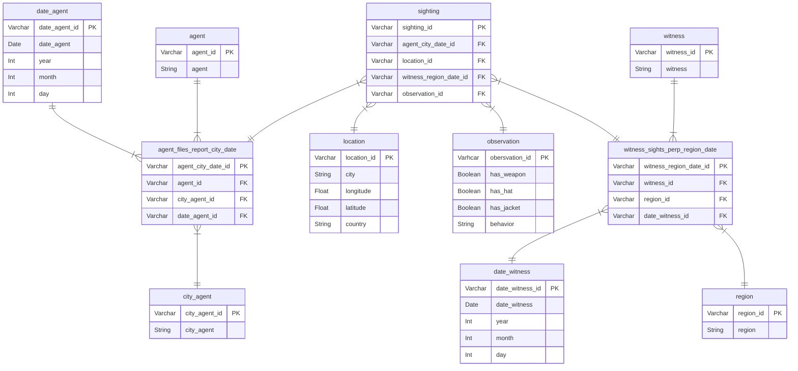

# Skill Assessment: Data Engineer - Crystal Taylor

## Requirements
- <a href='https://python-poetry.org/docs/'>poetry</a>
- python 3.12 or greater

## Steps to install
```
git clone https://github.com/crystalgtaylor91/wheres-carmen.git
cd wheres-carmen
poetry install
poetry shell
cd wheres_carmen_dbt
dbt deps
dbt seed
dbt run
```

## Additional steps
I have created an addition python function [*excel_to_csv.py*](https://github.com/crystalgtaylor91/wheres-carmen/blob/main/scripts/excel_to_csv.py)
This function loops through the [*data*](https://github.com/crystalgtaylor91/wheres-carmen/blob/main/data) folder and extract xlsx workbooks (including individual tabs to the [*seeds*](https://github.com/crystalgtaylor91/wheres-carmen/blob/main/wheres_carmen_dbt/models/seeds)) folder, and appends a column with the worksheet name to the dataset, in this use case this is the 'region' column
To run the function the source and targets are required as follows:
```
python scripts/excel_to_csv.py data/ wheres_carmen_dbt/seeds/
```

## Notes
I have used duckDB for it's simplicity as per your recommendation
In a production environment I would use linters such as sqlfluff to ensure templates are consistent to standards
I have used <a href='https://docs.getdbt.com/docs/collaborate/govern/model-contracts'>model contracts</a> in the processed layer, the junction tables define foreign key constraints on dependent entity tables, this can cause issues if you are trying to make changes to columns within those tables. To make changes to tables which have foreign key constraints the project must be run again as follows:
```
dbt clean
dbt deps
dbt seed
dbt run
```
Model contracts can make changes difficult but these are good for ensuring modelled data adheres to set standards

## Entity Relationship Diagram for Processed layer


## Analytics
Notes: I wasn't sure from the wording of the question whether this was supposed to be an aggregate of all months or broken down by month and year so i have broken down by month and year but to convert to aggregation of months in the analytics models I would simply remove date from the column specification and group by clauses

### a. For each month, which agency region is Carmen Sandiego most likely to be found?
See model [*analytics_mode_agency_region.sql*](https://github.com/crystalgtaylor91/wheres-carmen/blob/main/wheres_carmen_dbt/models/analytics/analytics_mode_agency_region.sql)


### b. Also for each month, what is the probability that Ms. Sandiego is armed AND wearing a jacket, but NOT a hat? What general observations about Ms. Sandiego can you make from this?
See model [*analytics_probability_armed_jacket_not_hat.sql*](https://github.com/crystalgtaylor91/wheres-carmen/blob/main/wheres_carmen_dbt/models/analytics/analytics_probability_armed_jacket_not_hat.sql)
There is a very low probability that Carmen is armed and wearing a jacket but not a hat
Some metrics to illustrate this:
- mode & average: 0.03
- max: ~5 days out of a month


### c. what are the 3 most occuring behaviors?
See model [*analytics_common_behaviors.sql*](https://github.com/crystalgtaylor91/wheres-carmen/blob/main/wheres_carmen_dbt/models/analytics/analytics_common_behaviors.sql)
| Behavior |
| ------------ |
| out-of-control |
| complaining |
| happy |


### d.  For each month, what is the probability Ms. Sandiego exhibits one of her three most occurring behaviors?  
See model [*analytics_probability_behavior_occurs.sql*](https://github.com/crystalgtaylor91/wheres-carmen/blob/main/wheres_carmen_dbt/models/analytics/analytics_probability_behavior_occurs.sql)
